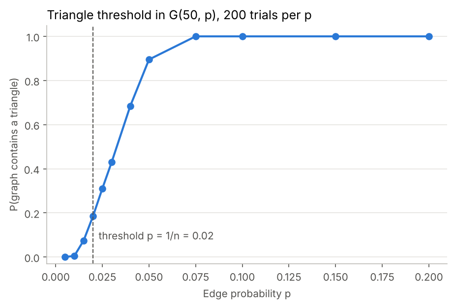
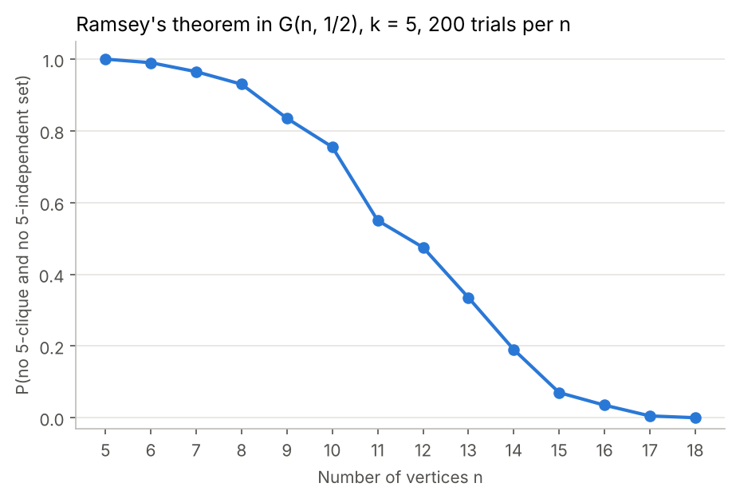
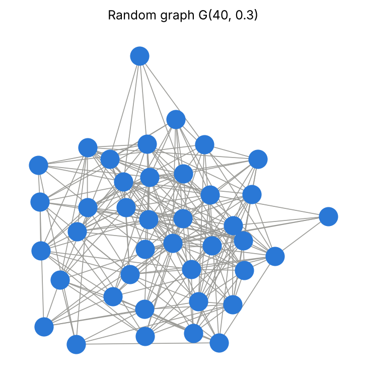

# Random Graphs: Thresholds and Ramsey Theory

Code and results from my BSc Mathematics dissertation at Heriot-Watt University (March 2026), on the binomial random graph **G(n, p)**: a graph on *n* vertices where each possible edge appears independently with probability *p*.

**[Read the full dissertation (PDF)](dissertation.pdf)**

The dissertation proves two classic results and checks both with Monte Carlo simulation in Python:

1. **Erdős's lower bound on Ramsey numbers**, R(k) ≥ 2^(k/2 − 1), proved with the probabilistic method.
2. **The triangle threshold**: p = 1/n is a threshold for G(n, p) to contain a triangle. The probability tends to 0 when p ≪ 1/n (Markov's inequality) and to 1 when p ≫ 1/n (second moment method).

## Key result: a sharp threshold



In 50-vertex random graphs (200 trials for each *p*), the chance of finding a triangle moves from **0 at p = 0.005** to **1 by p = 0.075**, with the steep rise centred on the theoretical threshold **p = 1/n = 0.02**.

Threshold behaviour like this matters beyond pure maths. In network models of **disease spread**, each person is a vertex and an edge means enough contact to pass on an infection. There is a critical contact probability above which a large outbreak becomes almost inevitable.

## Ramsey's theorem in random graphs



Ramsey's theorem says every large enough graph contains either a clique or an independent set of size *k*. For random graphs G(n, 1/2) with k = 5, the chance of avoiding both falls from **0.99 at n = 6 to 0 by n = 18** (200 trials per n). Exact enumeration of every possible graph confirms the simulation: for n = 5, P = 0.998 exactly, against 1.00 simulated, and for n = 6, P = 0.990 exactly, against 0.99 simulated.

At the size given by Erdős's bound, n = ⌈2^(k/2 − 1)⌉, a "witness" graph with no k-clique and no k-independent set was found on the first random draw for every k = 8, 9, 10, 11. This is consistent with the bound.

## How it works

| File | What it does |
| --- | --- |
| `random_graph.py` | Generates G(n, p) as a symmetric 0/1 adjacency matrix with NumPy; draws graphs with NetworkX |
| `ramsey.py` | Clique / independent-set detection over all k-subsets; Ramsey (k = 5) and Erdős-bound simulations; exact enumeration check |
| `triangles.py` | Triangle detection using linear algebra: **trace(A³)** counts closed walks of length 3, which is 6 × the number of triangles |
| `run_all.py` | Reproduces every table (`results/`) and figure (`figures/`) |

## Run it

```bash
pip install -r requirements.txt
python run_all.py      # about 20 seconds
```

All simulations use fixed random seeds, so results are reproducible.



## References

- J. Erde, *Random Graphs*, lecture notes (2019): the primary reference for the dissertation
- N. Alon and J. Spencer, *The Probabilistic Method*, 4th ed., Wiley (2016)
- P. Erdős and A. Rényi, "On random graphs I", *Publicationes Mathematicae Debrecen* 6 (1959)
- S. Zhao et al., "Edge-based modelling for disease transmission on random graphs", *Royal Society Open Science* 12(4) (2025)

## Author

**Daniel Oliver**, MSc Artificial Intelligence student, University of Edinburgh
